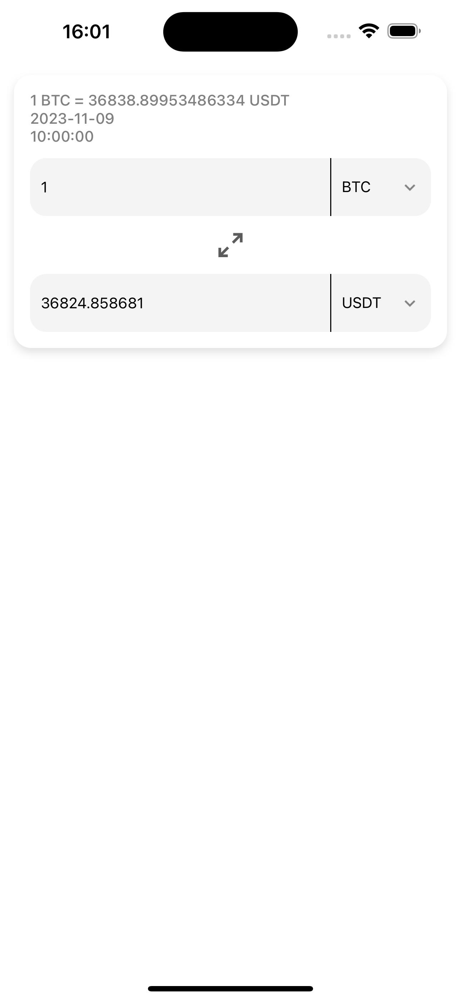
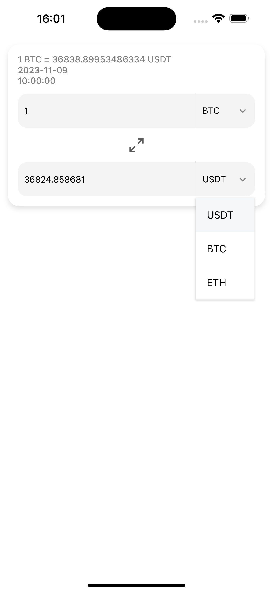
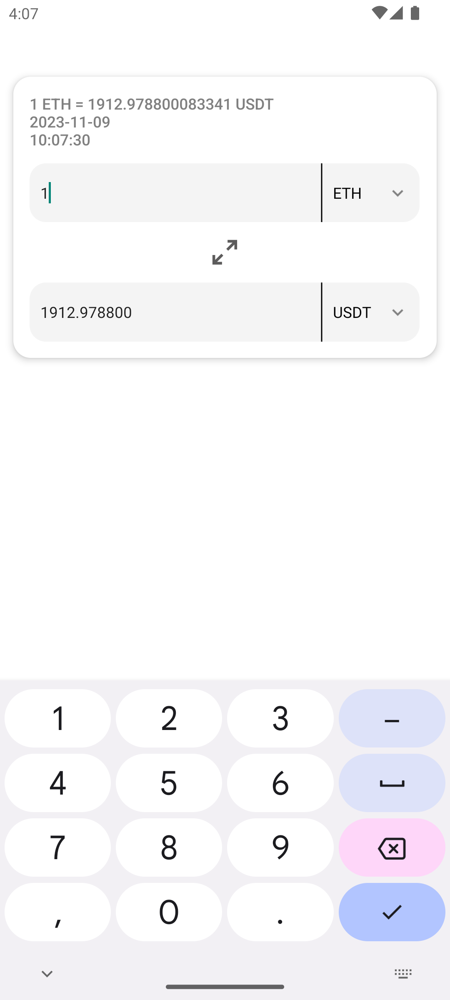

# Crypto-Convert

A simple cryptocurrency converter. 3 main currencies are available: USDT, BTS, ETH. To use in the file src->api->coin.ts, paste your API key from the platform [CoinApi](https://docs.coinapi.io)

# Screenshots

  
   
   

